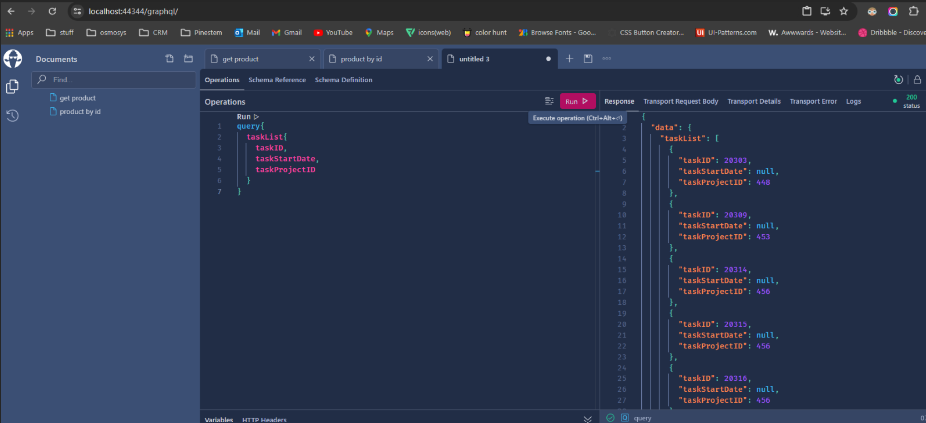
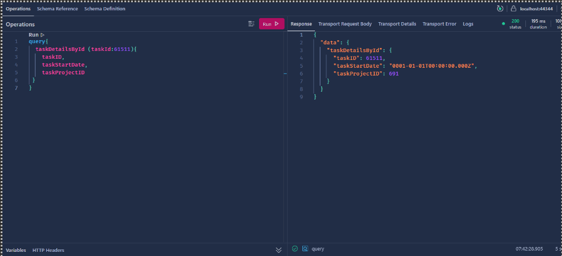

# GraphQL Implementation in .NET 7 using Hot Chocolate

This README provides a guide on how to implement GraphQL in a .NET 7 project using Hot Chocolate. The provided GraphQL query is an example used for fetching task details by task ID.

## Prerequisites

Make sure you have the following installed:

- [.NET 7](https://dotnet.microsoft.com/download)
- [Visual Studio](https://visualstudio.microsoft.com/) or [VS Code](https://code.visualstudio.com/)

## Project Setup

1. **Create a new .NET 7 project:**

   ```bash
   dotnet new web -n YourGraphQLProject
   cd YourGraphQLProject
   ```

2. **Add Hot Chocolate NuGet package:**

   ```bash
   dotnet add package HotChocolate.AspNetCore
   ```

3. **Configure the DbContext**

   ```csharp
    public class DbContextClass : DbContext
    {
       public DbContextClass(DbContextOptions<DbContextClass> options) : base(options)
       {

       }

       public DbSet<ProductDetails> Products { get; set; }
       public DbSet<TaskDetails> Tasks { get; set; }
       protected override void OnModelCreating(ModelBuilder modelBuilder)
       {
           modelBuilder.Seed();
           base.OnModelCreating(modelBuilder);
       }
    }
   ```

4. **Create GraphQL Types and Schema:**

   In your project, create a `Entities` folder to hold models. For example, create a `TaskDetails.cs`:

   ```csharp
    public class TaskDetails
    {
        [Key]
        public long TaskID { get; set; }
        public string TaskName { get; set; }
        public long? TaskDisplayID { get; set; }
        public DateTime? TaskDueDate { get; set; }
        public DateTime? TaskStartDate { get; set; }
        public long? AssignedTo { get; set; }

        [Column("TaskCreatedDate")]
        public DateTime? CreatedOn { get; set; }
        public long? TaskProjectID { get; set; }
        public int? TaskPriorityID { get; set; }
        public byte? TaskDifficultyID { get; set; }
        public long? SprintID { get; set; }
        public long? CompetencyID { get; set; }
        public long? TotalBillableHours { get; set; }
        public long? TotalNonBillableHours { get; set; }
    }
   ```

   Next, create a `TaskQueryTypes.cs` inside GraphQL `QueryTypes` folder:

   ```csharp
    public class TaskQueryTypes
    {
        public async Task<List<TaskDetails>> GetTaskListAsync([Service] ITaskService taskService)
        {
            return await taskService.TaskListAsync();
        }

        public async Task<TaskDetails> GetTaskDetailsByIdAsync([Service] ITaskService taskService, long taskId)
        {
            return await taskService.GetTaskDetailByIdAsync(taskId);
        }
    }
   ```

5. **Create GraphQL Repository:**

   Create a `ITaskService.cs` interface :

   ```csharp
    public interface ITaskService
    {
        public Task<List<TaskDetails>> TaskListAsync();

        public Task<TaskDetails> GetTaskDetailByIdAsync(long taskId);
    }
   ```

   Implement the `ITaskService` interface in `TaskService.cs`

   ```csharp
   public class TaskService : ITaskService
    {
        private readonly DbContextClass dbContextClass;

        public TaskService(DbContextClass dbContextClass)
        {
            this.dbContextClass = dbContextClass;
        }

        public async Task<List<TaskDetails>> TaskListAsync()
        {
            return await dbContextClass.Tasks.ToListAsync();
        }

        public async Task<TaskDetails> GetTaskDetailByIdAsync(long taskId)
        {
            return await dbContextClass.Tasks.Where(ele => ele.TaskID == taskId).FirstOrDefaultAsync();
        }
    }
   ```

6. **Configure program.cs:**

   In `Program.cs`, configure GraphQL Services:

   ```csharp
   var builder = WebApplication.CreateBuilder(args);

    //Register Service
    builder.Services.AddScoped<ITaskService, TaskService>();

    // Database
    builder.Services.AddDbContext<DbContextClass>(options =>
    {
        string connectionString = builder.Configuration.GetConnectionString("DBConnection");
        options.UseMySql(connectionString, ServerVersion.AutoDetect(connectionString));
    });

    //GraphQL Config
    builder.Services.AddGraphQLServer()
        .AddQueryType<TaskQueryTypes>();

    var app = builder.Build();

    //GraphQL
    app.MapGraphQL();
    app.UseHttpsRedirection();
    app.Run();
   ```

7. **Run the Application:**

   ```bash
   dotnet run
   ```

   Visit [https://localhost:5001/graphql](https://localhost:5001/graphql) to explore your GraphQL endpoint using tools like [Altair](https://altair.sirmuel.design/) or [GraphQL Playground](https://www.graphqlbin.com/).

8. **Output**

   - Get Task List

   

   - Get Task By ID

   
