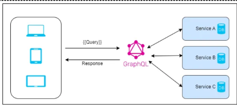

# GraphQL Demo with .NET Core 7 and Hot Chocolate

This repository demonstrates the implementation of GraphQL in a .NET Core 7 project using Hot Chocolate. The application utilizes the PineStem Task Details table as an example for illustrating GraphQL functionalities

## Getting Started

GraphQL is an open-source server-side technology developed by Facebook to optimize RESTful API calls. It serves as a query language for APIs and a server-side runtime for executing queries and collecting data from different sources.

### What is GraphQL?

- GraphQL allows us to fetch exactly the data we need using a single endpoint, optimizing API calls.
- It is strongly typed, enabling validation of queries within GraphQL before execution, contributing to building more robust APIs.
- GraphQL is known for its speed, stability, and ability to consistently provide predictable results.

    

If you want to learn more about GraphQL and dive deeper into its concepts and usage, check out the official website of [GraphQL](https://graphql.org/).

### Installation

1. **Clone the repository:**

   ```bash
   git clone https://github.com/your-username/graphql-demo-dotnetcore.git
   cd graphql-demo-dotnetcore
   ```

2. **Open the solution in Visual Studio or your preferred code editor.**

3. **Set up your MySQL database and update the connection string in `appsettings.json`:**

   ```json
   "ConnectionStrings": {
       "DBConnection": "Your_MySQL_Connection_String_Here"
   }
   ```

4. **Run the application:**

   ```bash
   dotnet run
   ```

5. **Open your browser and navigate to [https://localhost:5001/graphql](https://localhost:5001/graphql) to access the GraphQL Playground.**

## Project Structure

- **Entities**: Contains the data models like `TaskDetails`.
- **Data**: Holds the `DbContextClass` responsible for database interactions.
- **Repositories**: Includes the repository interface (`ITaskService`) and its implementation (`TaskService`).
- **GraphQL**:
  - **QueryTypes**: Contains the GraphQL query types like `TaskQueryTypes`.
  - **MutationTypes**: Placeholder for future mutation types.
  - **Types**: Defines GraphQL types used in queries.

**Note**: For a detailed guide on the implementation, refer to the [Implementation Documentation](Implementation.md).

## GraphQL Queries

### Get Task List

```graphql
query {
  getTaskList {
    taskID
    taskName
    taskDueDate
    assignedTo
  }
}
```

### Get TaskDetails by ID

```graphql
query {
  getTaskDetailsById(taskId: 1) {
    taskID
    taskName
    taskDueDate
    assignedTo
  }
}
```
